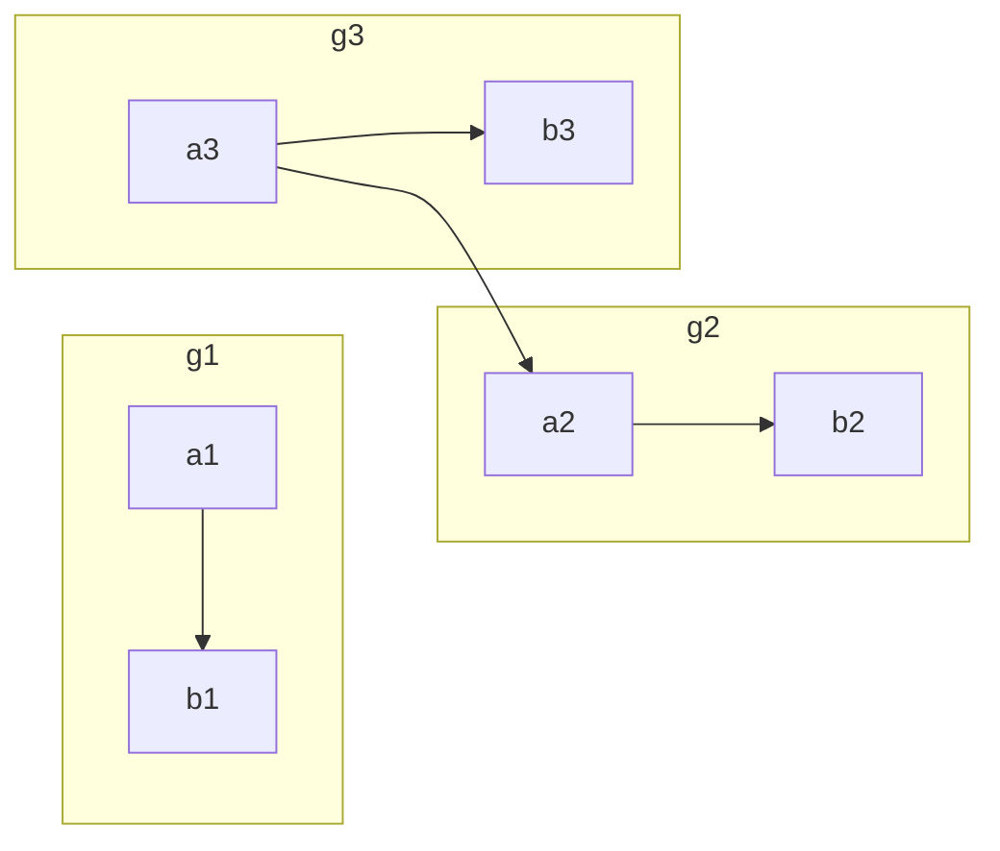

```mermaid
flowchat
st=>start: Start
e=>end: End
op1=>operation: Operation
sub1=>subroutine: Subroutine
cond=>condition: yes or no ?
io=>inputoutput: proceess something...
st->op1->cond`
cond(yes)->io->e`
cond(no)->sub1(right)->op1
```
